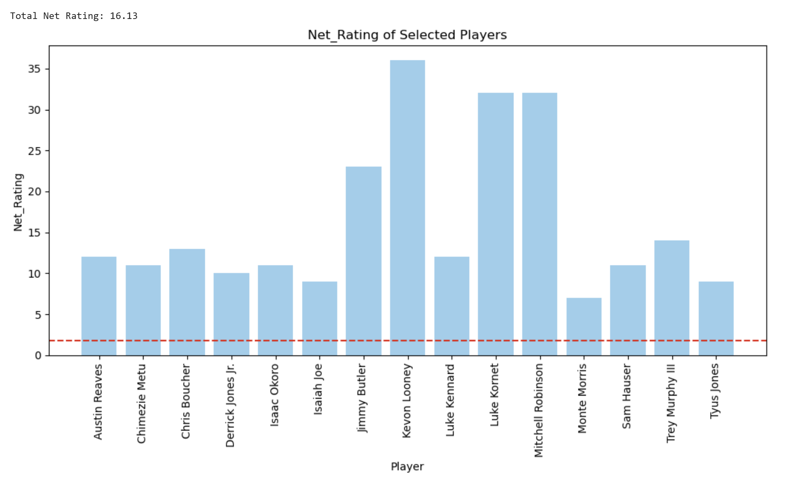
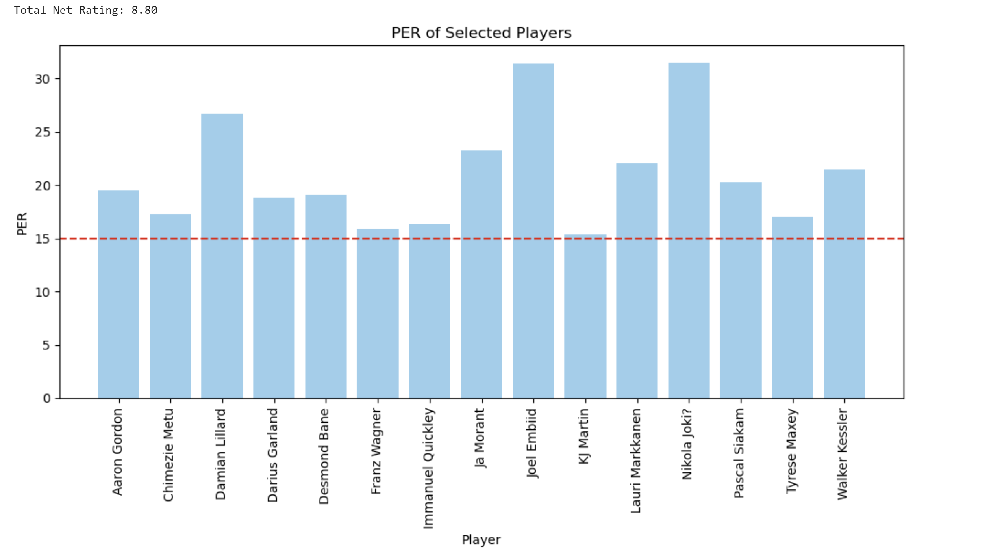
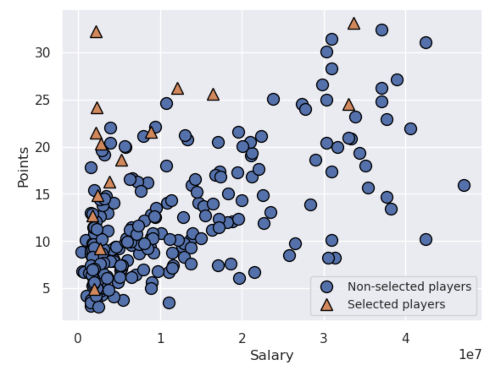
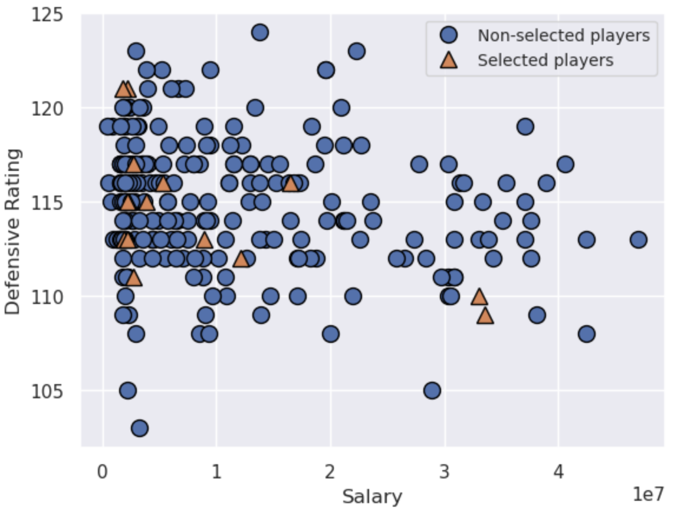
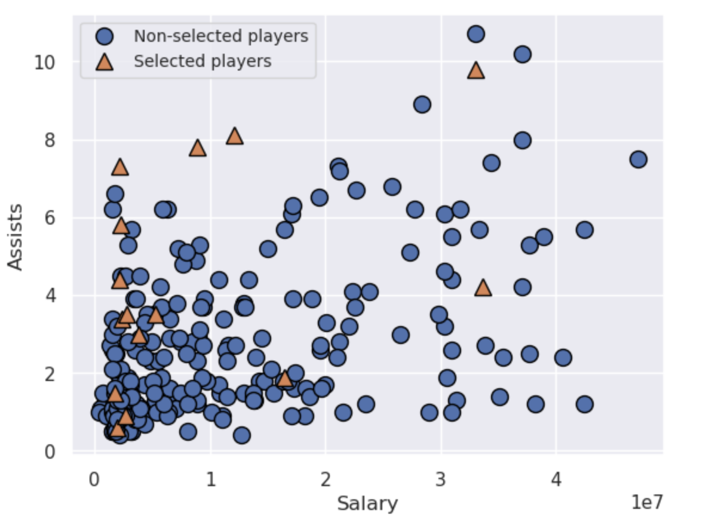
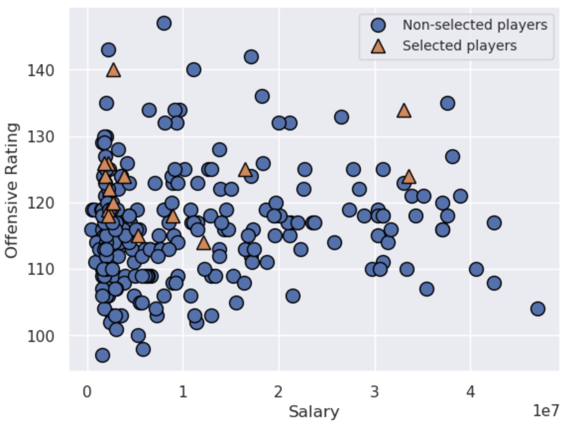
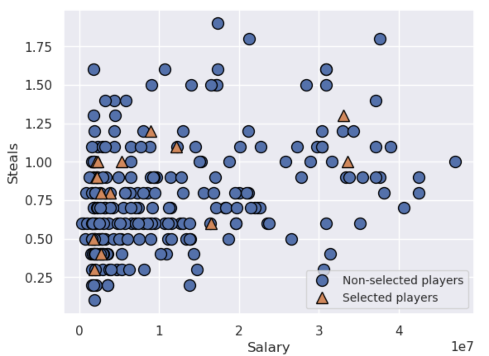
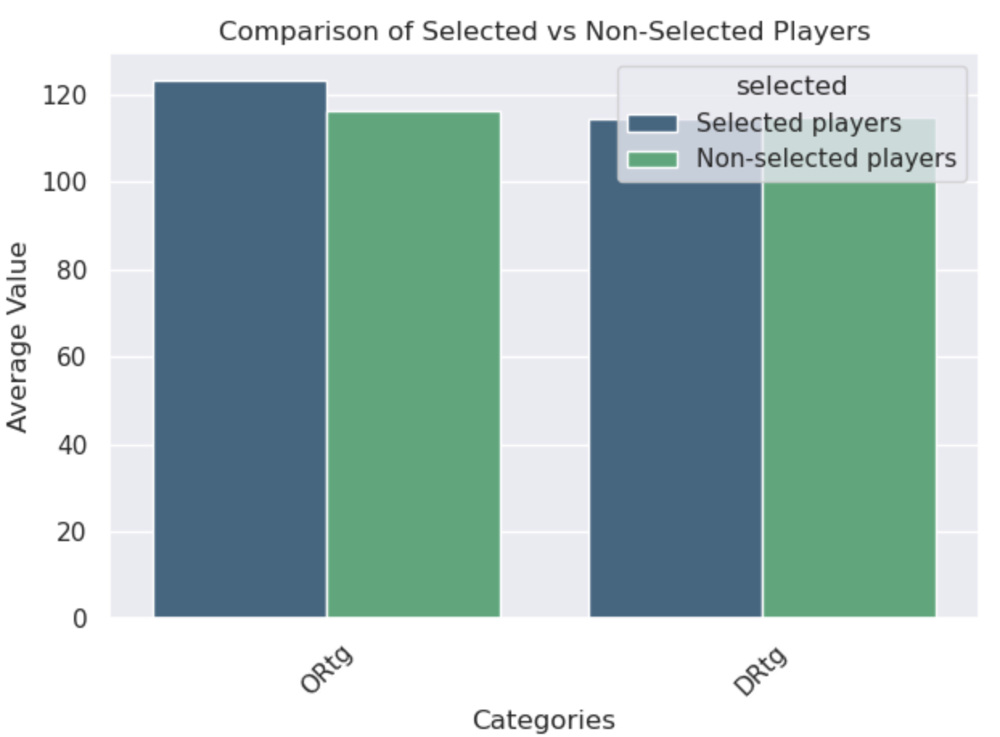
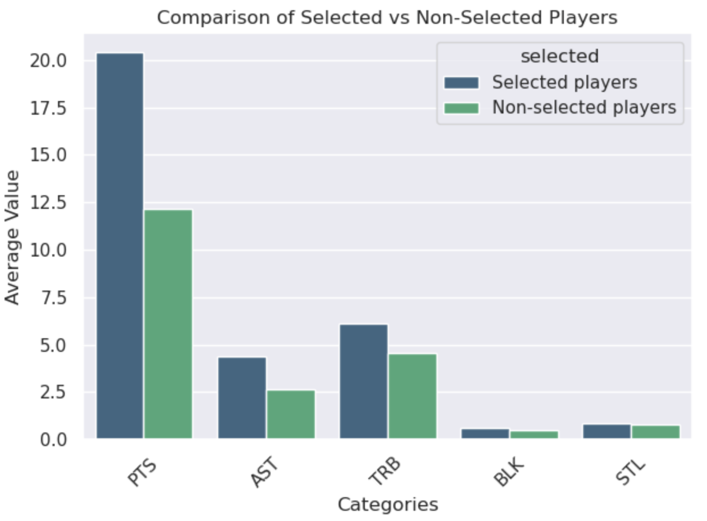

   # Finding the Fantasy Team
**Group 7: Liam A., Jashan B., James W., Yao W.**  
**March 2025**

---

## Introduction

The National Basketball Association, known as the NBA, is the most watched basketball league in the world, with millions of fans tuning in to support their favourite teams every season. One of the most common conversations among fans is who they would like to add to their team if they were the general manager. Lots of fans will often feel they can run their team much better and win a championship. We set out to try and answer that question of which players to choose as a GM to make the best team in the NBA. We did this with the help of combinatorial optimization by framing roster choice as a 0-1 packing problem. 
As expected, there were multiple challenges because defining what numerically makes a team great is one of the biggest unsolved questions in sports analysis. We ended up having three distinct metrics for the value of a player and thus three different objective functions. 
The weakest team was generated from maximizing the roster’s Net Rating (Offensive Rating – Defensive Rating). The second best and possibly most realistic team from the perspective of a General Manager in the NBA was generated by maximizing the player efficiency rating (PER). Lastly, the best team was generated from minimizing each player's distance from the league leaders with respect to their individual stats. This team was deemed too overpowered, and the trades to acquire it would likely be infeasible due to the high value of each player. If the trades were somehow possible, they would likely be vetoed by the commissioner of the NBA as done in the past to block certain players from teaming up.

---

## Mathematical Tools and Theory

### A Twist of the Knapsack Problem

The problem at hand is a twist on the classic knapsack problem.

$$ \text{max } \sum_i v_i x_i $$
$$ \text{subject to} $$
$$ \sum_i w_i x_i \le C $$

```math
\text{max } \sum_i v_i x_i
```

```math
\text{subject to}
```

```math
\sum_i w_i x_i \le C
```

Where $v_i$ is the value of item $i$, $x_i$ indicates whether item $i$ is chosen or not, $w_i$ is the weight of item $i$ and $C$ is the maximum weight that the knapsack can hold.

Instead of packing the most valuable items in the knapsack, the optimal NBA team would amalgamate players to build the best performing team. Team performance has to be quantified by some metric. In this project, team performance was chosen to be quantified three different ways:

1. The net rating: player offensive rating − player defensive rating  
2. The total efficiency rating  
3. The "distance" from leading statistics  

The salary of each player would be the individual weights in the knapsack problem and the budget a team manager has for purchasing the team would be the maximum capacity the knapsack can hold. The problem aims at choosing the best performing players within the league maximum NBA operating budget.

---

### Additional Constraints

Aside from the salary cap that a team has, there are additional constraints to comply with game technicalities as well as ensuring that players are not only affordable but have high performing statistics.

One constraint would be roster size. There can only be so many players and spares on a team. There has to be at least one of each position as well so that the algorithm doesn't only select players that main one position.

Another constraint would be average performance statistics. To select an optimal team, there has to be a benchmark to quantify how good the selected players are. Otherwise, the algorithm might choose players purely based on salary and not consider performance.

---

## Definitions and Notation

In general, the problems will be modelled as a twist of the classical knapsack problem:

```math
\text{max } \sum_i v_i x_i
```

```math
\text{subject to}
```

```math
\sum_i w_i x_i \le C
```

```math
\mathbf{A}x \ge b
```

For the programs formulated, these are some key variables that will be used:

- $v_i$ represents the quantified value that player $i$ brings.  
- $x_i$ is the decision variable (0 or 1).  
- $\mathbf{A}$ is a matrix of statistical measures.  
- $b_i$ is the minimum statistical requirement for each stat.  
- $w_i$ represents each player's salary.  
- $\alpha$ represents a varying scalar applied to offensive rating.  
- $\beta$ represents a varying scalar applied to defensive rating.  

$\alpha$ and $\beta$ are parameters in the objective function to adjust weights of offensive and defensive rating.

---

## Modelling Process

### Preprocessing the Data

All data collection was done through  
`[cite: data]` for the player stats. The stats collected were:   Points `PTS`, Rebounds `REB`, Assists `AST`, Steals `STL`, Blocks `BLK`, Offensive Rating `ORTG`, Defensive Rating `DRTG`, Win Shares `WS`.

Then, we needed to collect the stats which would help narrow our selection set, particularly because some players who have only played a handful of games or even a few minutes would have very high offensive rating. One such player was Braxton Key who had an ORTG of 227. To put into perspective how high this is, the MVP of that season, Joel Embiid had an ORTG of 124. This was because Braxton Key had only played 9 minutes in the entire season across 3 games and did not miss a shot during those 9 minutes. He also only attempted 5 shots that season. Therefore, we restricted our dataset to players who had played at least 58 games that season, which is also the league minimum to be considered for league leader in a stat. Similarly, we restricted the minutes played per game to above 5 minutes which is approximately 10\% of a 48 minute game. This took our data set of 537 players down to 245 players.

Finally, the other set of data we needed to collect was a stat breakdown of a “good” team. We did so by looking at the championship rosters over a 20 year span from 2003-2023. The stats for each winning roster was simply a sum of each stat from each player on the roster. For example, to get the points per game of a winning team we would simply sum the points per game of each player on the roster. We then averaged out those sums over the 20 winning teams to get an “ideal stat threshold” of roughly 

- 110.8 Points
- 25.3 Assists
- 45.6 Rebounds
- 8.5 Steals
- 5.8 Blocks

all of which were the per game stats. This collection of “ideal stats” to use as a threshold constraint was necessary because, as mentioned above, certain players could still have high Offensive Rating or Player Efficiency while not having high stats. This threshold ensures that our overall team maintains a high collection of stats. More importantly, this constraint will ensure that we have a balanced roster which does not over prioritize a given stat. For example, without this threshold we could get a team of very offensive players that gives us an incredibly high points per game value but they could all have very low assists. This would mean the team wouldn’t be likely to actually get that many points because the players selected would not be ones that typically share the ball.

---

### Setting Up the Model

All three of our models had the exact same constraints according to the following equations. In the objective function $v^T$ represents our value coefficient which differs for each of the 3 approaches.


$$ \quad & (v^Tx) \\ \text{subject to the conditions:} \quad & a_{11}x_1 + a_{12}x_2 + \dots + a_{1n}x_n \geq 110.8\; Points, \\ & a_{21}x_1 + a_{22}x_2 + \dots + a_{2n}x_n \geq 25.3 \;Assists, \\ & a_{31}x_1 + a_{32}x_2 + \dots + a_{3n}x_n \geq 45.6\; Rebounds, \\  & a_{41}x_1 + a_{42}x_2 + \dots + a_{4n}x_n \geq 8.5\; Steals, \\ & a_{51}x_1 + a_{52}x_2 + \dots + a_{5n}x_n \geq 5.8\; Blocks,\\ & a_{61}x_1 + a_{62}x_2 + \dots + a_{6n}x_n \leq 136,021,000\; Salary Cap,\\ & x_1, x_2, \dots,x_n \in {0,1} $$

```math
\text{Maximize } (v^T x)
```

```math
a_{11}x_1 + \dots + a_{1n}x_n \ge 110.8 \text{ Points}
```

```math
a_{21}x_1 + \dots + a_{2n}x_n \ge 25.3 \text{ Assists}
```

```math
a_{31}x_1 + \dots + a_{3n}x_n \ge 45.6 \text{ Rebounds}
```

```math
a_{41}x_1 + \dots + a_{4n}x_n \ge 8.5 \text{ Steals}
```

```math
a_{51}x_1 + \dots + a_{5n}x_n \ge 5.8 \text{ Blocks}
```

```math
a_{61}x_1 + \dots + a_{6n}x_n \le 136{,}021{,}000 \text{ Salary Cap}
```

```math
x_i \in \{0,1\}
```

We also added constraints to ensure the roster had at least 14 players and at most 15 players according to the NBA restrictions on roster size. In addition to this, we limited the choices to have at least two players from each position: 

### Player positions


---

## Approach 1: Maximize Net Rating (ORTG − DRTG)

In the first approach, we chose an objective function which maximized the ‘Net Rating’ of each player. The Net Rating is calculated by subtracting the defensive rating from the offensive rating. Offensive Rating and Defensive Ratings are a complex statistic first defined by statistician Dean Oliver. The breakdown of the calculation can be seen at \cite{odratings}.  Plainly put, Offensive Rating is a measure of how many points is a player likely to generate over 100 possessions. Defensive Rating is a measure of how many points the player allows the opposition to score per 100 possessions. This is why Net Rating is calculated as $Offensive - Defensive$. The greater the difference between points scored and points allowed, the better that player is. The objective function was therefore:

```math
\text{Max } (\textbf{Net Rating})^T \mathbf{x} \text{ with the constraint } A\mathbf{x}\geq b
```

using the constraints mentioned in equation (1).
This approach gave us the following roster.



---

## Approach 2: Maximize Player Efficiency Rating (PER)

PER is computed as:

In our second approach, we chose an objective function which maximized the ‘Player Efficiency Rating’ of each player. The PER is calculated as a 

$$ \sum {(\text{Positive contributions}) - (\text{Negative Contributions})} $$ 
$$ 1 + 1 = 2 $$

and returns a per minute rating of the players performance. An example of a positive contribution is points, assists, rebounds. Negative contributions are shown in stats like missed shots, turnovers, fouls, etc. The Player Efficiency Rating statistic was created by ESPN columnist John Hollinger. A larger breakdown of how this is calculated can be seen at \cite{per}. The objective function is as follows:
$$\text{Max } (\textbf{PER})^T \mathbf{x} \text{ with the constraint } A\mathbf{x}\geq b$$ using the constraints mentioned in equation (1).
This approach gave us the following roster.



---

## Approach 3: Minimize Distance to Best in the League

League leaders:

- PTS: 33.1 (Embiid)
- REB: 12.3 (Sabonis)
- AST: 10.7 (Harden)
- WS: 14.9 (Jokic)

Objective:

```math
\text{Min } \left( |33.1 - PTS| + |12.3 - REB| + |10.7 - AST| + |14.9 - WS| \right)^T x
```

This produced the strongest (but unrealistic) roster:


---

## Comparison of Selected vs Non-selected Players

Scatter plot examples:









Average stats comparison:




---

## Conclusion and Future Considerations

Overall, the league-leaders (Approach 3) team is unrealistic due to contract restrictions, despite being statistically optimal.

Between the Net Rating team and PER team, the choice is subjective. The Net Rating team resembles real NBA construction more closely, while the PER team contains four All-Stars, which is less common historically.

---

## Future Considerations

Basketball defense is difficult to quantify because steals and blocks are rare. Future improvements may include:

- Using more stats (e.g., shot percentage, attempts, 3PT shooting)  
- Using machine learning to create new player-value metrics  
- Including chemistry-based objective functions depending on combinations of playstyles  

---

## References

